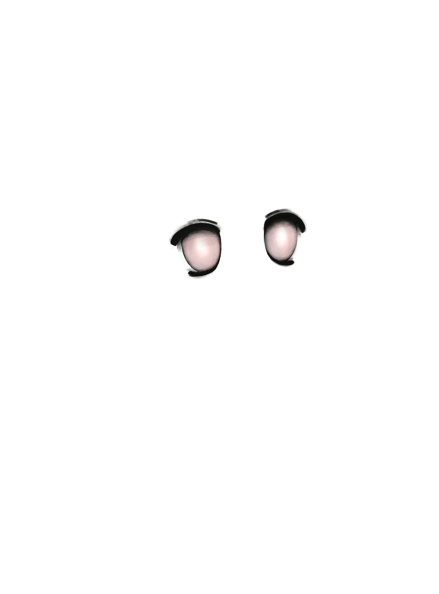
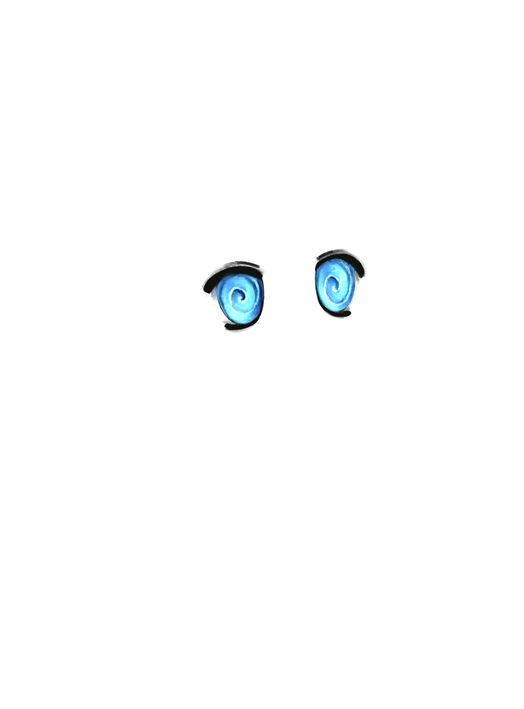
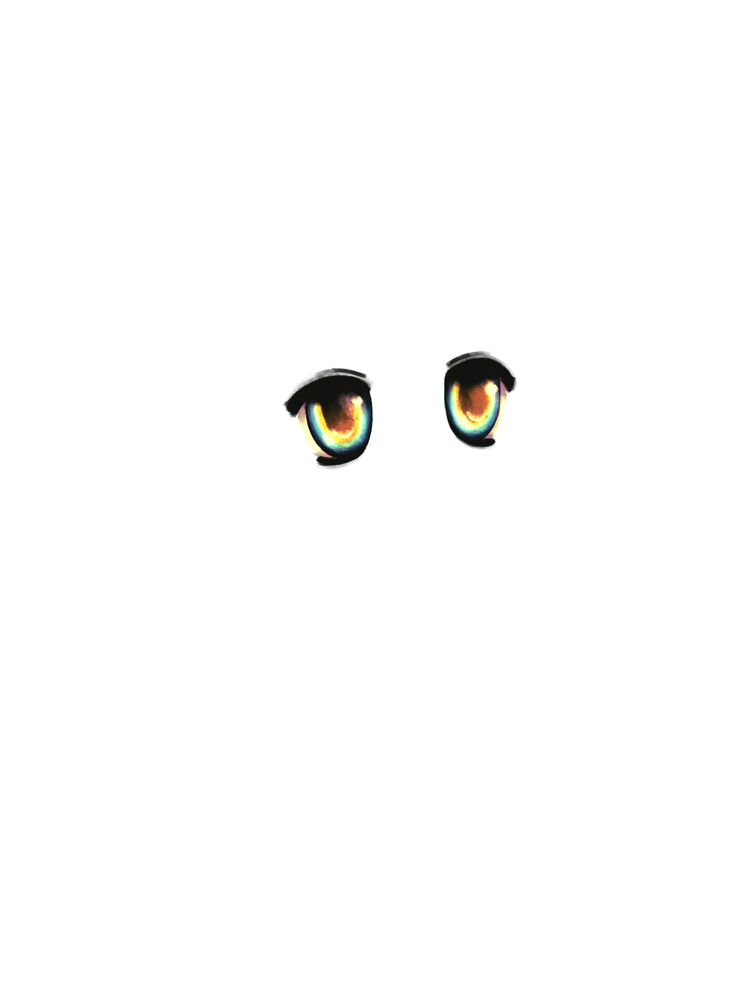
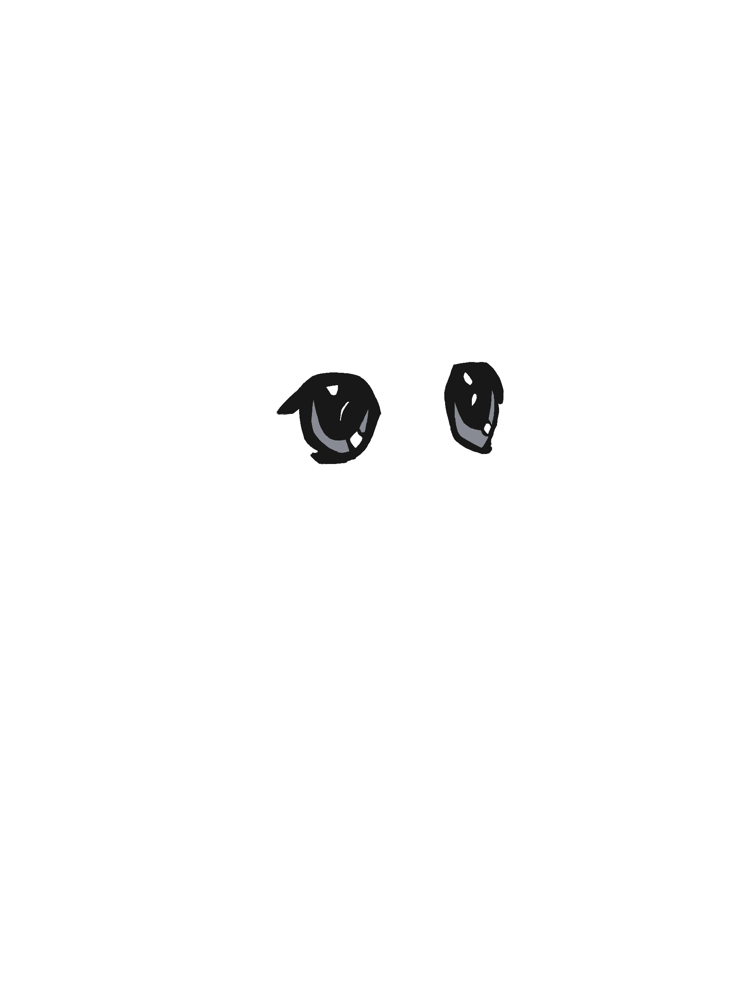
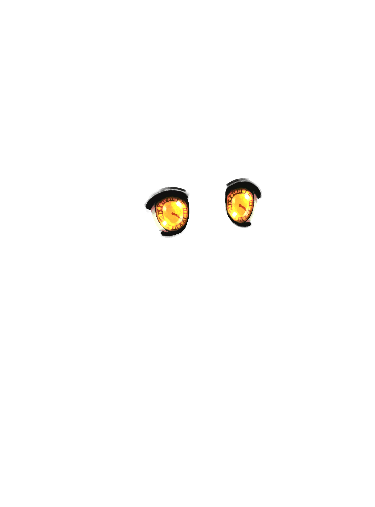
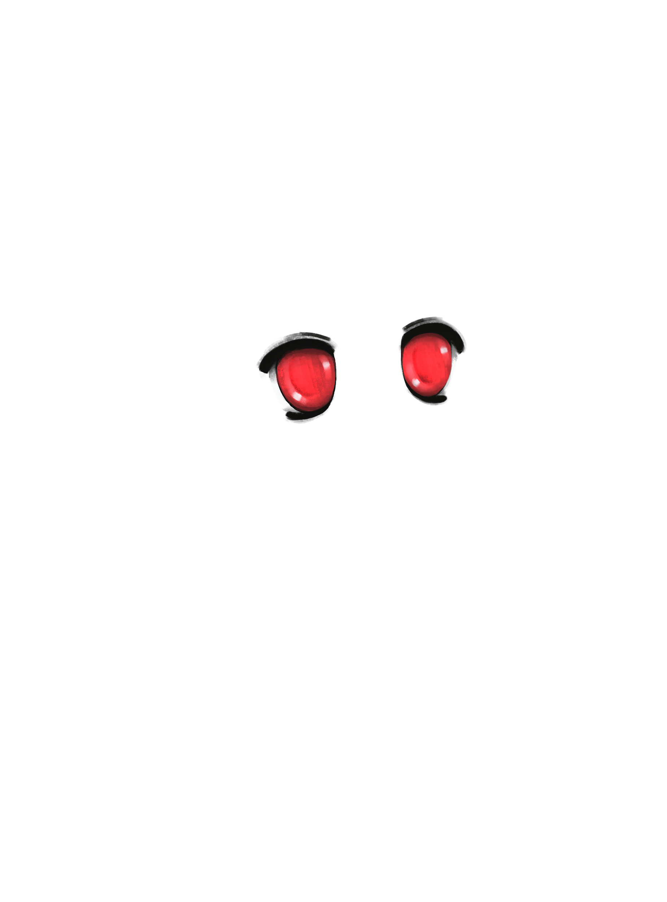
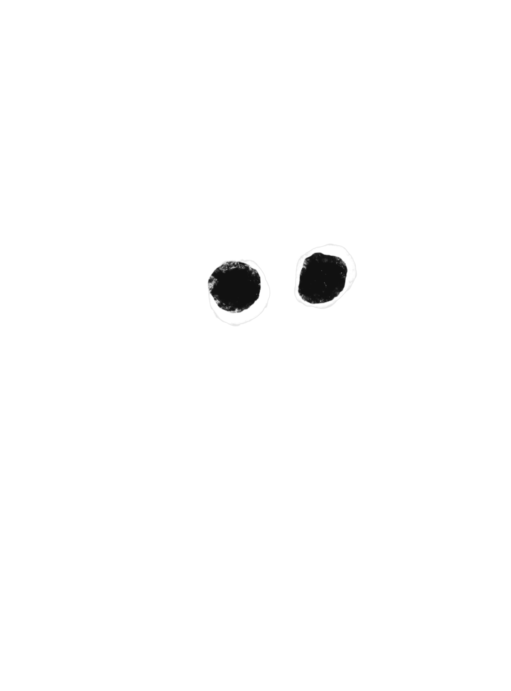

# Eyes

*Eye variations reflecting different states and aesthetics.*

---

## stoned brown

EYES

**Name:** stoned brown

**Brief Visual Description:** Brown eyes. The whites of the eyes are red, eyelids partially lowered.

**Dominant Colors:** brown

**Reasoning for Inclusion within Mibera:**

**General Real World Trait History:** Not applicable

**Team Anecdotes:**

**Date Created / Uploaded:** June 3, 2024

**Who Introduced the Trait:**

**Trait Conflicts:**

---

## ecstasy sky

EYES

**Name:** ecstasy sky

**Brief Visual Description:** sky-blue eyes with heavily dilated pupils.

**Dominant Colors:** Lilac

**Reasoning for Inclusion within Mibera:**

**General Real World Trait History:** Not applicable

**Team Anecdotes:**

**Date Created / Uploaded:** June 3, 2024

**Who Introduced the Trait:** Jani

**Trait Conflicts:**

---

## hypno brown

EYES

**Name:** hypno brown

**Brief Visual Description:** brown eyes with prominent white spirals.

**Dominant Colors:** black and white, brown

**Reasoning for Inclusion within Mibera:**

**General Real World Trait History:** Not applicable

**Team Anecdotes:**

**Date Created / Uploaded:** June 3, 2024

**Who Introduced the Trait:** Gumi

**Trait Conflicts:**

---

## normal lilac

EYES

**Name:** Normal Lilac

**Image Files:**

- https://discord.com/channels/1133935527855399053/1245166789822775469/12471887811536

52876 (found on Discord but not Google Drive)

**Brief Visual Description:** Normal eyes with a purple hue.

**Dominant Colors:** Lilac

**Reasoning for Inclusion within Mibera:** The normal eyes were primarily constructed the way

they were to have more direct visual coherency with the Milady Maker eyes. Different enough to

be Mibera, but still close enough to Milady to be recognized as such.

**General Real World Trait History:** Not applicable

**Team Anecdotes:**

**Date Created / Uploaded:** June 3, 2024

**Who Introduced the Trait:** Gumi

**Trait Conflicts:**

---

## normal leaf

EYES

**Name:** normal leaf

**Brief Visual Description:** normal leafy-green eyes

**Dominant Colors:** green

**Reasoning for Inclusion within Mibera:** The normal eyes were primarily constructed the way

they were to have more direct visual coherency with the Milady Maker eyes. Different enough to

be Mibera, but still close enough to Milady to be recognized as such.

**General Real World Trait History:** Not applicable

**Team Anecdotes:**

**Date Created / Uploaded:** June 3, 2024

**Who Introduced the Trait:** Gumi

**Trait Conflicts:**

---

## normal sky

EYES

**Name:** normal (sky)

**Brief Visual Description:** normal eyes in a sky-blue.

**Dominant Colors:**

**Reasoning for Inclusion within Mibera:** The normal eyes were primarily constructed the way

they were to have more direct visual coherency with the Milady Maker eyes. Different enough to

be Mibera, but still close enough to Milady to be recognized as such.

**General Real World Trait History:** Not applicable

**Team Anecdotes:**

**Date Created / Uploaded:** June 3, 2024

**Who Introduced the Trait:** Gumi

**Trait Conflicts:**

---

## normal gold

EYES

**Name:** normal gold

**Brief Visual Description:** normal eyes, brighter than brown.

**Dominant Colors:**

**Reasoning for Inclusion within Mibera:** The normal eyes were primarily constructed the way

they were to have more direct visual coherency with the Milady Maker eyes. Different enough to

be Mibera, but still close enough to Milady to be recognized as such.

**General Real World Trait History:** Not applicable

**Team Anecdotes:**

**Date Created / Uploaded:** June 3, 2024

**Who Introduced the Trait:** Gumi

**Trait Conflicts:**

---

## normal grey

EYES

**Name:** normal grey

**Brief Visual Description:** normal eyes in grey.

**Dominant Colors:**

**Reasoning for Inclusion within Mibera:** The normal eyes were primarily constructed the way

they were to have more direct visual coherency with the Milady Maker eyes. Different enough to

be Mibera, but still close enough to Milady to be recognized as such.

**General Real World Trait History:** Not applicable

**Team Anecdotes:**

**Date Created / Uploaded:** June 3, 2024

**Who Introduced the Trait:** Gumi

**Trait Conflicts:**

---

## normal ocean

EYES

**Name:** normal ocean

**Brief Visual Description:** normal eyes in bright ocean blue.

**Dominant Colors:** teal-blue

**Reasoning for Inclusion within Mibera:** The normal eyes were primarily constructed the way

they were to have more direct visual coherency with the Milady Maker eyes. Different enough to

be Mibera, but still close enough to Milady to be recognized as such.

**General Real World Trait History:** Not applicable

**Team Anecdotes:**

**Date Created / Uploaded:** June 3, 2024

**Who Introduced the Trait:** Gumi

**Trait Conflicts:**

---

## normal brown

EYES

**Name:** normal brown

**Brief Visual Description:** normal eyes in earthy brown.

**Dominant Colors:** brown

**Reasoning for Inclusion within Mibera:** The normal eyes were primarily constructed the way

they were to have more direct visual coherency with the Milady Maker eyes. Different enough to

be Mibera, but still close enough to Milady to be recognized as such.

**General Real World Trait History:** Not applicable

**Team Anecdotes:**

**Date Created / Uploaded:** June 3, 2024

**Who Introduced the Trait:** Gumi

**Trait Conflicts:**

---

## heart leaf

EYES

**Name:** heart leaf

**Brief Visual Description:** eyes with heart-shaped pupils in leafy green.

**Dominant Colors:** leafy green

**Reasoning for Inclusion within Mibera:**

**General Real World Trait History:** Not applicable

**Team Anecdotes:**

**Date Created / Uploaded:** June 3, 2024

**Who Introduced the Trait:** Gumi

**Trait Conflicts:**

---

## heart brown

EYES

**Name:** heart brown

**Brief Visual Description:** eyes with heart-shaped pupils in brown.

**Dominant Colors:** brown

**Reasoning for Inclusion within Mibera:**

**General Real World Trait History:** Not applicable

**Team Anecdotes:**

**Date Created / Uploaded:** June 3, 2024

**Who Introduced the Trait:** Gumi

**Trait Conflicts:**

---

## sparkle forest

EYES

**Name:** sparkle forest

**Brief Visual Description:** deep-green eyes with three white dots between the iris and pupil.

**Dominant Colors:** deep green

**Reasoning for Inclusion within Mibera:**

**General Real World Trait History:** Not applicable

**Team Anecdotes:**

**Date Created / Uploaded:** June 3, 2024

**Who Introduced the Trait:** Gumi

**Trait Conflicts:**

---

## bright brown

EYES

**Name:** bright brown

**Brief Visual Description:** brown eyes with a large white four pointed star within the pupil

**Dominant Colors:** brown

**Reasoning for Inclusion within Mibera:**

**General Real World Trait History:** Not applicable

**Team Anecdotes:**

**Date Created / Uploaded:** June 3, 2024

**Who Introduced the Trait:** Gumi

**Trait Conflicts:**

---

## sparkle brown

EYES

**Name:** sparkle brown

**Brief Visual Description:** Brown eyes with three white dots between the iris and pupil.

**Dominant Colors:** brown

**Reasoning for Inclusion within Mibera:**

**General Real World Trait History:** Not applicable

**Team Anecdotes:**

**Date Created / Uploaded:** June 3, 2024

**Who Introduced the Trait:** Gumi

**Trait Conflicts:**

---

## heart ocean

EYES

**Name:** heart ocean

**Brief Visual Description:** eyes with heart-shaped pupils in dark teal..

**Dominant Colors:**

**Reasoning for Inclusion within Mibera:**

**General Real World Trait History:** Not applicable

**Team Anecdotes:**

**Date Created / Uploaded:** June 3, 2024

**Who Introduced the Trait:** Gumi

**Trait Conflicts:**

---

## sparkle leaf

EYES

**Name:** sparkle leaf

**Brief Visual Description:** leafy-green eyes with three white dots between the iris and pupil.

**Dominant Colors:** leafy green

**Reasoning for Inclusion within Mibera:**

**General Real World Trait History:** Not applicable

**Team Anecdotes:**

**Date Created / Uploaded:** June 3, 2024

**Who Introduced the Trait:** Gumi

**Trait Conflicts:**

---

## heart grey

**Name:** Heart Grey

**Brief Visual Description:** Eyes with heart-shaped pupils in grey.

**Dominant Colors:** Grey

**Reasoning for Inclusion within Mibera:** There are grey eyes within the original milady

collection.

https://opensea.io/collection/milady?traits=%5B%7B%22traitType%22:%22Eye+Color%22,%22

**values%22:** %5B%22grey%22%5D%7D%5D

Hearts in order to visually convey a love-pilled aesthetic.

**General Real World Trait History:** Not applicable

**Team Anecdotes:**

**Date Created / Uploaded:** June 3, 2024

**Who Introduced the Trait:** Gumi

**Trait Conflicts:**

---

## bright gold

EYES

**Name:** bright gold

**Brief Visual Description:** golden eyes with a large white four pointed star within the pupil

**Dominant Colors:** golden

**Reasoning for Inclusion within Mibera:**

**General Real World Trait History:** Not applicable

**Team Anecdotes:**

**Date Created / Uploaded:** June 3, 2024

**Who Introduced the Trait:** Gumi

**Trait Conflicts:**

---

## heart lilac

EYES

**Name:** heart lilac

**Brief Visual Description:** eyes with heart-shaped pupils in lilac

**Dominant Colors:** lilac

**Reasoning for Inclusion within Mibera:**

**General Real World Trait History:** Not applicable

**Team Anecdotes:**

**Date Created / Uploaded:** June 3, 2024

**Who Introduced the Trait:** Gumi

**Trait Conflicts:**

---

## sparkle lilac

EYES

**Name:** sparkle lilac

**Brief Visual Description:** lilac eyes with three white dots between the iris and pupil.

**Dominant Colors:** lilac

**Reasoning for Inclusion within Mibera:**

**General Real World Trait History:** Not applicable

**Team Anecdotes:**

**Date Created / Uploaded:** June 3, 2024

**Who Introduced the Trait:** Gumi

**Trait Conflicts:**

---

## sparkle gold

EYES

**Name:** sparkle gold

**Brief Visual Description:** golden eyes with three white dots between the iris and pupil.

**Dominant Colors:** gold

**Reasoning for Inclusion within Mibera:**

**General Real World Trait History:** Not applicable

**Team Anecdotes:**

**Date Created / Uploaded:** June 3, 2024

**Who Introduced the Trait:** Gumi

**Trait Conflicts:**

---

## heart gold

EYES

**Name:** heart gold

**Brief Visual Description:** eyes with heart-shaped pupils in matte gold.

**Dominant Colors:** gold

**Reasoning for Inclusion within Mibera:**

**General Real World Trait History:** Not applicable

**Team Anecdotes:**

**Date Created / Uploaded:** June 3, 2024

**Who Introduced the Trait:** Gumi

**Trait Conflicts:**

---

## sparkle sky

EYES

**Name:** sparkle sky

**Brief Visual Description:** sky-blue eyes with three white dots between the iris and pupil.

**Dominant Colors:** sky blue

**Reasoning for Inclusion within Mibera:**

**General Real World Trait History:** Not applicable

**Team Anecdotes:**

**Date Created / Uploaded:** June 3, 2024

**Who Introduced the Trait:** Gumi

**Trait Conflicts:**

---

## sparkle grey

EYES

**Name:** sparkle grey

**Brief Visual Description:** grey eyes with three white dots between the iris and pupil.

**Dominant Colors:** grey

**Reasoning for Inclusion within Mibera:**

**General Real World Trait History:** Not applicable

**Team Anecdotes:**

**Date Created / Uploaded:** June 3, 2024

**Who Introduced the Trait:** Gumi

**Trait Conflicts:**

---

## sparkle ocean

EYES

**Name:** sparkle ocean

**Brief Visual Description:** teal eyes with three white dots between the iris and pupil.

**Dominant Colors:** dark teal

**Reasoning for Inclusion within Mibera:**

**General Real World Trait History:** Not applicable

**Team Anecdotes:**

**Date Created / Uploaded:** June 3, 2024

**Who Introduced the Trait:** Gumi

**Trait Conflicts:**

---

## bright lilac

EYES

**Name:** bright lilac

**Brief Visual Description:** bright purple eyes with a large white four pointed star within the pupil

**Dominant Colors:** lilac purple

**Reasoning for Inclusion within Mibera:**

**General Real World Trait History:** Not applicable

**Team Anecdotes:**

**Date Created / Uploaded:** June 3, 2024

**Who Introduced the Trait:** Gumi

**Trait Conflicts:**

---

## bright leaf

EYES

**Name:** bright leaf

**Brief Visual Description:** bright leafy green eyes with a large white four pointed star within the

pupil

**Dominant Colors:** leafy green

**Reasoning for Inclusion within Mibera:**

**General Real World Trait History:** Not applicable

**Team Anecdotes:**

**Date Created / Uploaded:** June 3, 2024

**Who Introduced the Trait:** Gumi

**Trait Conflicts:**

---

## heart sky

EYES

**Name:** heart sky

**Brief Visual Description:** eyes with heart-shaped pupils in blue.

**Dominant Colors:** blue

**Reasoning for Inclusion within Mibera:**

**General Real World Trait History:** Not applicable

**Team Anecdotes:**

**Date Created / Uploaded:** June 3, 2024

**Who Introduced the Trait:** Gumi

**Trait Conflicts:**

---

## bright sky

EYES

**Name:** bright sky

**Brief Visual Description:** blue eyes with a large white four pointed star within the pupil

**Dominant Colors:** blue

**Reasoning for Inclusion within Mibera:**

**General Real World Trait History:** Not applicable

**Team Anecdotes:**

**Date Created / Uploaded:** June 3, 2024

**Who Introduced the Trait:** Gumi

**Trait Conflicts:**

---

## bright grey

EYES

**Name:** bright grey

**Brief Visual Description:** grey eyes with a large white four pointed star within the pupil

**Dominant Colors:** grey

**Reasoning for Inclusion within Mibera:**

**General Real World Trait History:** Not applicable

**Team Anecdotes:**

**Date Created / Uploaded:** June 3, 2024

**Who Introduced the Trait:** Gumi

**Trait Conflicts:**

---

## bright ocean

EYES

**Name:** bright ocean

**Brief Visual Description:** teal eyes with a large white four pointed star within the pupil

**Dominant Colors:** shades of teal

**Reasoning for Inclusion within Mibera:**

**General Real World Trait History:** Not applicable

**Team Anecdotes:**

**Date Created / Uploaded:** June 3, 2024

**Who Introduced the Trait:** Gumi

**Trait Conflicts:**

---

## stoned gold

EYES

**Name:** stoned gold

**Brief Visual Description:** golden eyes. The whites of the eyes are red, eyelids partially

lowered.

**Dominant Colors:** gold, red

**Reasoning for Inclusion within Mibera:**

**General Real World Trait History:** Not applicable

**Team Anecdotes:**

**Date Created / Uploaded:** June 3, 2024

**Who Introduced the Trait:** Gumi

**Trait Conflicts:**

---

## sleepy ocean

EYES

**Name:** sleepy ocean

**Brief Visual Description:** tired eyes with vibrant teal iris

**Dominant Colors:** shades of teal

**Reasoning for Inclusion within Mibera:**

**General Real World Trait History:** Not applicable

**Team Anecdotes:**

**Date Created / Uploaded:** June 3, 2024

**Who Introduced the Trait:** Gumi

**Trait Conflicts:**

---

## stoned lilac

EYES

**Name:** stoned lilac

**Brief Visual Description:** bright-purple eyes. The whites of the eyes are red, eyelids partially

lowered.

**Dominant Colors:** bright purple, red

**Reasoning for Inclusion within Mibera:**

**General Real World Trait History:** Not applicable

**Team Anecdotes:**

**Date Created / Uploaded:** June 3, 2024

**Who Introduced the Trait:** Gumi

**Trait Conflicts:**

---

## sleepy gold

EYES

**Name:** sleepy gold

**Brief Visual Description:** tired eyes with golden iris.

**Dominant Colors:** shades of gold, black.

**Reasoning for Inclusion within Mibera:**

**General Real World Trait History:** Not applicable

**Team Anecdotes:**

**Date Created / Uploaded:** June 3, 2024

**Who Introduced the Trait:** Gumi

**Trait Conflicts:**

---

## ecstasy ocean

EYES

**Name:** ecstasy ocean

**Brief Visual Description:** teal eyes with heavily dilated pupils.

**Dominant Colors:** black, teal

**Reasoning for Inclusion within Mibera:**

**General Real World Trait History:** Not applicable

**Team Anecdotes:**

**Date Created / Uploaded:** June 3, 2024

**Who Introduced the Trait:** Gumi

**Trait Conflicts:**

---

## stoned grey

EYES

**Name:** stoned grey

**Brief Visual Description:** grey eyes. The whites of the eyes are red, eyelids partially lowered.

**Dominant Colors:** grey, red

**Reasoning for Inclusion within Mibera:**

**General Real World Trait History:** Not applicable

**Team Anecdotes:**

**Date Created / Uploaded:** June 3, 2024

**Who Introduced the Trait:** Gumi

**Trait Conflicts:**

---

## sleepy leaf

EYES

**Name:** sleepy leaf

**Brief Visual Description:** tired eyes with leafy green iris.

**Dominant Colors:** leafy green, black.

**Reasoning for Inclusion within Mibera:**

**General Real World Trait History:** Not applicable

**Team Anecdotes:**

**Date Created / Uploaded:** June 3, 2024

**Who Introduced the Trait:** Gumi

**Trait Conflicts:**

---

## stoned sky

EYES

**Name:** stoned sky

**Brief Visual Description:** bright-blue eyes. The whites of the eyes are red, eyelids partially

lowered.

**Dominant Colors:** blue, red

**Reasoning for Inclusion within Mibera:**

**General Real World Trait History:** Not applicable

**Team Anecdotes:**

**Date Created / Uploaded:** June 3, 2024

**Who Introduced the Trait:** Gumi

**Trait Conflicts:**

---

## sleepy grey

EYES

**Name:** sleepy grey

**Brief Visual Description:** tired eyes with grey iris.

**Dominant Colors:** grey, black.

**Reasoning for Inclusion within Mibera:**

**General Real World Trait History:** Not applicable

**Team Anecdotes:**

**Date Created / Uploaded:** June 3, 2024

**Who Introduced the Trait:** Gumi

**Trait Conflicts:**

---

## sleepy sky

EYES

**Name:** sleepy sky

**Brief Visual Description:** tired eyes with grey iris

**Dominant Colors:** shades of grey

**Reasoning for Inclusion within Mibera:**

**General Real World Trait History:** Not applicable

**Team Anecdotes:**

**Date Created / Uploaded:** June 3, 2024

**Who Introduced the Trait:** Gumi

**Trait Conflicts:**

---

## pinhole ocean

EYES

**Name:** pinhole ocean

**Brief Visual Description:** teal eyes with constricted pupils, or usually known as pinpoint pupils.

**Dominant Colors:** dark teal

**Reasoning for Inclusion within Mibera:**

**General Real World Trait History:** Not applicable

**Team Anecdotes:**

**Date Created / Uploaded:** June 3, 2024

**Who Introduced the Trait:** Gumi

**Trait Conflicts:**

---

## stoned leaf

EYES

**Name:** stoned leaf

**Brief Visual Description:** leafy-green eyes. The whites of the eyes are red, eyelids partially

lowered.

**Dominant Colors:** green, red

**Reasoning for Inclusion within Mibera:**

**General Real World Trait History:** Not applicable

**Team Anecdotes:**

**Date Created / Uploaded:** June 3, 2024

**Who Introduced the Trait:** Gumi

**Trait Conflicts:**

---

## sleepy brown

EYES

**Name:** sleepy brown

**Brief Visual Description:** tired eyes with brown iris.

**Dominant Colors:** brown, black

**Reasoning for Inclusion within Mibera:**

**General Real World Trait History:** Not applicable

**Team Anecdotes:**

**Date Created / Uploaded:** June 3, 2024

**Who Introduced the Trait:** Gumi

**Trait Conflicts:**

---

## hypno leaf

EYES

**Name:** hypno leaf

**Brief Visual Description:** leafy green eyes with prominent white spirals.

**Dominant Colors:** black and white, green.

**Reasoning for Inclusion within Mibera:**

**General Real World Trait History:** Not applicable

**Team Anecdotes:**

**Date Created / Uploaded:** June 3, 2024

**Who Introduced the Trait:** Gumi

**Trait Conflicts:**

---

## ecstasy grey

EYES

**Name:** ecstasy grey

**Brief Visual Description:** grey eyes with heavily dilated pupils.

**Dominant Colors:** grey, black

**Reasoning for Inclusion within Mibera:**

**General Real World Trait History:** Not applicable

**Team Anecdotes:**

**Date Created / Uploaded:** June 3, 2024

**Who Introduced the Trait:** Gumi

**Trait Conflicts:**

---

## stoned ocean

EYES

**Name:** stoned ocean

**Brief Visual Description:** teal eyes. The whites of the eyes are red, eyelids partially lowered.

**Dominant Colors:** bright teal

**Reasoning for Inclusion within Mibera:**

**General Real World Trait History:** Not applicable

**Team Anecdotes:**

**Date Created / Uploaded:** June 3, 2024

**Who Introduced the Trait:** Gumi

**Trait Conflicts:**

---

## sleepy lilac

EYES

**Name:** sleepy lilac

**Brief Visual Description:** tired eyes with bright purple iris

**Dominant Colors:** bright purple / lilac

**Reasoning for Inclusion within Mibera:**

**General Real World Trait History:** Not applicable

**Team Anecdotes:**

**Date Created / Uploaded:** June 3, 2024

**Who Introduced the Trait:** Gumi

**Trait Conflicts:**

---

## ecstasty brown

EYES

**Name:** ecstasy brown

**Brief Visual Description:** brown eyes with heavily dilated pupils.

**Dominant Colors:** brown, black

**Reasoning for Inclusion within Mibera:**

**General Real World Trait History:** Not applicable

**Team Anecdotes:**

**Date Created / Uploaded:** June 3, 2024

**Who Introduced the Trait:** Gumi

**Trait Conflicts:**

---

## ecstasy leaf

EYES

**Name:** ecstasy leaf

**Brief Visual Description:** green eyes with heavily dilated pupils

**Dominant Colors:** green, black

**Reasoning for Inclusion within Mibera:**

**General Real World Trait History:** Not applicable

**Team Anecdotes:**

**Date Created / Uploaded:** June 3, 2024

**Who Introduced the Trait:** Gumi

**Trait Conflicts:**

---

## hypno grey

EYES

**Name:** hypno grey

**Brief Visual Description:** grey eyes with prominent white spirals.

**Dominant Colors:** black and white, grey

**Reasoning for Inclusion within Mibera:**

**General Real World Trait History:** Not applicable

**Team Anecdotes:**

**Date Created / Uploaded:** June 3, 2024

**Who Introduced the Trait:** Gumi

**Trait Conflicts:**

---

## pinhole lilac

EYES

**Name:** pinhole lilac

**Brief Visual Description:** lilac eyes with constricted pupils, or usually known as pinpoint pupils.

**Dominant Colors:** lilac

**Reasoning for Inclusion within Mibera:**

**General Real World Trait History:** Not applicable

**Team Anecdotes:**

**Date Created / Uploaded:** June 3, 2024

**Who Introduced the Trait:** Gumi

**Trait Conflicts:**

---

## crossed grey

EYES

**Name:** crossed grey

**Brief Visual Description:** crossed eyes with bright grey iris

**Dominant Colors:** grey

**Reasoning for Inclusion within Mibera:**

**General Real World Trait History:** Not applicable

**Team Anecdotes:**

**Date Created / Uploaded:** June 3, 2024

**Who Introduced the Trait:** Gumi

**Trait Conflicts:**

---

## crossed leaf

EYES

**Name:** crossed leaf

**Brief Visual Description:** crossed eyes with bright green iris.

**Dominant Colors:** bright green

**Reasoning for Inclusion within Mibera:**

**General Real World Trait History:** Not applicable

**Team Anecdotes:**

**Date Created / Uploaded:** June 3, 2024

**Who Introduced the Trait:** Gumi

**Trait Conflicts:**

---

## crying gold

EYES

**Name:** crying gold

**Brief Visual Description:** golden eyes with tears in the corners.

**Dominant Colors:** golden

**Reasoning for Inclusion within Mibera:**

**General Real World Trait History:** Not applicable

**Team Anecdotes:**

**Date Created / Uploaded:** June 3, 2024

**Who Introduced the Trait:** Gumi

**Trait Conflicts:**

---

## cying ocean

EYES

**Name:** crying ocean

**Brief Visual Description:** teal eyes with tears in the corners.

**Dominant Colors:** teal

**Reasoning for Inclusion within Mibera:**

**General Real World Trait History:** Not applicable

**Team Anecdotes:**

**Date Created / Uploaded:** June 3, 2024

**Who Introduced the Trait:** Gumi

**Trait Conflicts:**

---

## pinhole grey

EYES

**Name:** pinhole grey

**Brief Visual Description:** grey eyes with constricted pupils, or usually known as pinpoint pupils.

**Dominant Colors:** matte grey

**Reasoning for Inclusion within Mibera:**

**General Real World Trait History:** Not applicable

**Team Anecdotes:**

**Date Created / Uploaded:** June 3, 2024

**Who Introduced the Trait:** Gumi

**Trait Conflicts:**

---

## ecstasy lilac

EYES

**Name:** ecstasy lilac

**Brief Visual Description:** purple eyes with heavily dilated pupils.

**Dominant Colors:** purple, black

**Reasoning for Inclusion within Mibera:**

**General Real World Trait History:** Not applicable

**Team Anecdotes:**

**Date Created / Uploaded:** June 3, 2024

**Who Introduced the Trait:** Gumi

**Trait Conflicts:**

---

## crying sky

EYES

**Name:** crying sky

**Brief Visual Description:** sky-blue eyes with tears in the corners.

**Dominant Colors:**

**Reasoning for Inclusion within Mibera:**

**General Real World Trait History:** Not applicable

**Team Anecdotes:**

**Date Created / Uploaded:** June 3, 2024

**Who Introduced the Trait:** Gumi

**Trait Conflicts:**

---

## hypno sky

EYES

**Name:** hypno sky

**Brief Visual Description:** blue eyes with prominent white spirals.

**Dominant Colors:** black and white, blue

**Reasoning for Inclusion within Mibera:**

**General Real World Trait History:** Not applicable

**Team Anecdotes:**

**Date Created / Uploaded:** June 3, 2024

**Who Introduced the Trait:** Gumi

**Trait Conflicts:**

---

## ecstasy gold

EYES

**Name:** ecstasy gold

**Brief Visual Description:** golden eyes with heavily dilated pupils.

**Dominant Colors:** gold, black

**Reasoning for Inclusion within Mibera:**

**General Real World Trait History:** Not applicable

**Team Anecdotes:**

**Date Created / Uploaded:** June 3, 2024

**Who Introduced the Trait:** Gumi

**Trait Conflicts:**

---

## crying grey

EYES

**Name:** crying grey

**Brief Visual Description:** grey eyes with tears in the corners.

**Dominant Colors:** grey

**Reasoning for Inclusion within Mibera:**

**General Real World Trait History:** Not applicable

**Team Anecdotes:**

**Date Created / Uploaded:** June 3, 2024

**Who Introduced the Trait:** Gumi

**Trait Conflicts:**

---

## hypno ocean

EYES

**Name:** hypno ocean

**Brief Visual Description:** teal eyes with prominent white spirals.

**Dominant Colors:** black and white, teal

**Reasoning for Inclusion within Mibera:**

**General Real World Trait History:** Not applicable

**Team Anecdotes:**

**Date Created / Uploaded:** June 3, 2024

**Who Introduced the Trait:** Gumi

**Trait Conflicts:**

---

## pinhole sky

EYES

**Name:** pinhole sky

**Brief Visual Description:** sky-blue eyes with constricted pupils, or usually known as pinpoint

pupils.

**Dominant Colors:** sky-blue

**Reasoning for Inclusion within Mibera:**

**General Real World Trait History:** Not applicable

**Team Anecdotes:**

**Date Created / Uploaded:** June 3, 2024

**Who Introduced the Trait:** Gumi

**Trait Conflicts:**

---

## pinhole gold

EYES

**Name:** pinhole gold

**Brief Visual Description:** golden eyes with constricted pupils, or usually known as pinpoint

pupils.

**Dominant Colors:** matte golden

**Reasoning for Inclusion within Mibera:**

**General Real World Trait History:** Not applicable

**Team Anecdotes:**

**Date Created / Uploaded:** June 3, 2024

**Who Introduced the Trait:** Gumi

**Trait Conflicts:**

---

## hypno gold

EYES

**Name:** hypno gold

**Brief Visual Description:** golden brown eyes with prominent white spirals.

**Dominant Colors:** golden-brown

**Reasoning for Inclusion within Mibera:**

**General Real World Trait History:** Not applicable

**Team Anecdotes:**

**Date Created / Uploaded:** June 3, 2024

**Who Introduced the Trait:** Gumi

**Trait Conflicts:**

---

## crossed ocean

EYES

**Name:** crossed ocean

**Brief Visual Description:** crossed eyes with bright teal iris.

**Dominant Colors:** bright teal

**Reasoning for Inclusion within Mibera:**

**General Real World Trait History:** Not applicable

**Team Anecdotes:**

**Date Created / Uploaded:** June 3, 2024

**Who Introduced the Trait:** Gumi

**Trait Conflicts:**

---

## crying lilac

EYES

**Name:** crying lilac

**Brief Visual Description:** lilac eyes with tears in the corners.

**Dominant Colors:** purple / lilac

**Reasoning for Inclusion within Mibera:**

**General Real World Trait History:** Not applicable

**Team Anecdotes:**

**Date Created / Uploaded:** June 3, 2024

**Who Introduced the Trait:** Gumi

**Trait Conflicts:**

---

## crossed sky

EYES

**Name:** crossed sky

**Brief Visual Description:** crossed eyes with sky-blue iris.

**Dominant Colors:** sky-blue

**Reasoning for Inclusion within Mibera:**

**General Real World Trait History:** Not applicable

**Team Anecdotes:**

**Date Created / Uploaded:** June 3, 2024

**Who Introduced the Trait:** Gumi

**Trait Conflicts:**

---

## pinhole brown

EYES

**Name:** pinhole brown

**Brief Visual Description:** brown eyes with constricted pupils, or usually known as pinpoint

pupils.

**Dominant Colors:** brown

**Reasoning for Inclusion within Mibera:**

**General Real World Trait History:** Not applicable

**Team Anecdotes:**

**Date Created / Uploaded:** June 3, 2024

**Who Introduced the Trait:** Gumi

**Trait Conflicts:**

---

## crossed gold

EYES

**Name:** crossed gold

**Brief Visual Description:** crossed eyes with golden iris.

**Dominant Colors:** gold

**Reasoning for Inclusion within Mibera:**

**General Real World Trait History:** Not applicable

**Team Anecdotes:**

**Date Created / Uploaded:** June 3, 2024

**Who Introduced the Trait:** Gumi

**Trait Conflicts:**

---

## pinhole leaf

EYES

**Name:** pinhole leaf

**Brief Visual Description:** leafy green eyes with constricted pupils, or usually known as pinpoint

pupils.

**Dominant Colors:** green

**Reasoning for Inclusion within Mibera:**

**General Real World Trait History:** Not applicable

**Team Anecdotes:**

**Date Created / Uploaded:** June 3, 2024

**Who Introduced the Trait:** Gumi

**Trait Conflicts:**

---

## crying leaf

EYES

**Name:** crying leaf

**Brief Visual Description:** green eyes with tears in the corners.

**Dominant Colors:** bright green

**Reasoning for Inclusion within Mibera:**

**General Real World Trait History:** Not applicable

**Team Anecdotes:**

**Date Created / Uploaded:** June 3, 2024

**Who Introduced the Trait:** Gumi

**Trait Conflicts:**

---

## crossed brown

EYES

**Name:** crossed brown

**Brief Visual Description:** crossed eyes with brown iris.

**Dominant Colors:** brown

**Reasoning for Inclusion within Mibera:**

**General Real World Trait History:** Not applicable

**Team Anecdotes:**

**Date Created / Uploaded:** June 3, 2024

**Who Introduced the Trait:** Gumi

**Trait Conflicts:**

---

## hypno lilac

EYES

**Name:** hypno lilac

**Brief Visual Description:** purple eyes with prominent white spirals.

**Dominant Colors:** black and white, purple lilac

**Reasoning for Inclusion within Mibera:**

**General Real World Trait History:** Not applicable

**Team Anecdotes:**

**Date Created / Uploaded:** June 3, 2024

**Who Introduced the Trait:** Gumi

**Trait Conflicts:**

---

## blind

EYES

**Name:** blind

**Brief Visual Description:** complete white portraying a pair of blind eyes.

**Dominant Colors:** white

**Reasoning for Inclusion within Mibera:**

**General Real World Trait History:** Not applicable

**Team Anecdotes:**

**Date Created / Uploaded:** June 3, 2024

**Who Introduced the Trait:** Gumi

**Trait Conflicts:**

---

## whirlpool

EYES

**Name:** whirlpool

**Brief Visual Description:** bright blue eyes showcasing (or holding) whirlpools inside of them.

**Dominant Colors:** bright blue

**Reasoning for Inclusion within Mibera:**

**General Real World Trait History:** Not applicable

**Team Anecdotes:**

**Date Created / Uploaded:** June 3, 2024

**Who Introduced the Trait:** Gumi

**Trait Conflicts:**

---

## true love

EYES

**Name:** true love

**Brief Visual Description:** pink iris with hearty details showcasing eyes that seem to be in love.

**Dominant Colors:** pink

**Reasoning for Inclusion within Mibera:**

**General Real World Trait History:** Not applicable

**Team Anecdotes:**

**Date Created / Uploaded:** June 3, 2024

**Who Introduced the Trait:** Gumi

**Trait Conflicts:**

---

## crossed lilac

EYES

**Name:** crossed lilac

**Brief Visual Description:** crossed eyes with lilac iris.

**Dominant Colors:** lilac purple

**Reasoning for Inclusion within Mibera:**

**General Real World Trait History:** Not applicable

**Team Anecdotes:**

**Date Created / Uploaded:** June 3, 2024

**Who Introduced the Trait:** Gumi

**Trait Conflicts:**

---

## angelic

EYES

**Name:** angelic

**Brief Visual Description:** iridescent eyes, perhaps showcasing one’s angelic nature.

**Dominant Colors:** gold, yellow, turquoise

**Reasoning for Inclusion within Mibera:**

**General Real World Trait History:** Not applicable

**Team Anecdotes:**

**Date Created / Uploaded:** June 3, 2024

**Who Introduced the Trait:** Gumi

**Trait Conflicts:**

---

## crying brown

EYES

**Name:** crying brown

**Brief Visual Description:** Brown eyes with tears in the corners.

**Dominant Colors:** brown

**Reasoning for Inclusion within Mibera:**

**General Real World Trait History:** Not applicable

**Team Anecdotes:**

**Date Created / Uploaded:** June 3, 2024

**Who Introduced the Trait:** Gumi

**Trait Conflicts:**

---

## teddy

EYES

**Name:** teddy

**Brief Visual Description:** eyes in steady teddy’s style

**Dominant Colors:** black, grey

**Reasoning for Inclusion within Mibera:**

**General Real World Trait History:** Not applicable

**Team Anecdotes:**

**Date Created / Uploaded:** June 3, 2024

**Who Introduced the Trait:** Gumi

**Trait Conflicts:**

---

## clocks

EYES

**Name:** clocks

**Brief Visual Description:** a pair of bright yellow eyes showing a clock from each one of them.

**Dominant Colors:** bright yellow

**Reasoning for Inclusion within Mibera:**

**General Real World Trait History:** Not applicable

**Team Anecdotes:**

**Date Created / Uploaded:** June 3, 2024

**Who Introduced the Trait:** Gumi

**Trait Conflicts:**

---

## honey swirl

EYES

**Name:** honey swirl

**Brief Visual Description:** a pair of swirly yellow eyes that look like they’re made up of honey.

**Dominant Colors:** yellow

**Reasoning for Inclusion within Mibera:**

**General Real World Trait History:** Not applicable

**Team Anecdotes:**

**Date Created / Uploaded:** June 3, 2024

**Who Introduced the Trait:** Gumi

**Trait Conflicts:**

---

## demonic

EYES

**Name:** demonic

**Brief Visual Description:** plain red eyes with no visible iris. Somewhat demonic and soulless.

**Dominant Colors:** red

**Reasoning for Inclusion within Mibera:**

**General Real World Trait History:** Not applicable

**Team Anecdotes:**

**Date Created / Uploaded:** June 3, 2024

**Who Introduced the Trait:** Gumi

**Trait Conflicts:**

---

## henlo

EYES

**Name:** henlo

**Brief Visual Description:** a pair of ‘henlo’ eyes.

**Dominant Colors:** black, white

**Reasoning for Inclusion within Mibera:**

**General Real World Trait History:** Not applicable

**Team Anecdotes:**

**Date Created / Uploaded:** June 3, 2024

**Who Introduced the Trait:** Gumi

**Trait Conflicts:**

---

## meta eyes

EYES

**Name:** meta eyes

**Brief Visual Description:** "eyes" written in sloppy black text instead of actual eyes

**Dominant Colors:** black

**Reasoning for Inclusion within Mibera:**

**General Real World Trait History:** Not applicable

**Team Anecdotes:**

**Date Created / Uploaded:** June 3, 2024

**Who Introduced the Trait:** Gumi

**Trait Conflicts:**

---

